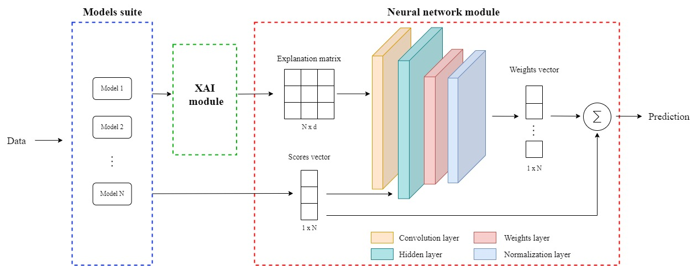

# Explusion_framework
A new approach to late fusion that exploits XAI explanations of individual models to perform a dynamic and flexible weighted sum for solving binary and other tasks. Explusion stands for "Explainable late fusion".

The complete architecture of the framework can be seen in the image. It is based primarily on the integration of three distinct modules, each designed to be able to address, solve, and fulfill specific functions.
In general, the framework realizes for all intents and purposes a late fusion technique by exploiting the heterogeneity and predictions of the classifiers belonging to the Models suite; the XAI module, on the other hand, provides transparency and explicability by computing explanation vectors via the SHAP tool, i.e., vectors within which reside explanations of feature importance; and finally, the Neural network module optimizes the combination of all this information in order to be able to realize a weighted sum necessary to perform the final prediction.

The proposed code can be implemented on any notebook, even if the implementation of the latter was done using Colab notebooks.
The code allows: submitting any binary dataset, adding or removing predictive models from the models suite, and finally exploiting the neural network to realize a custom weighted sum.
